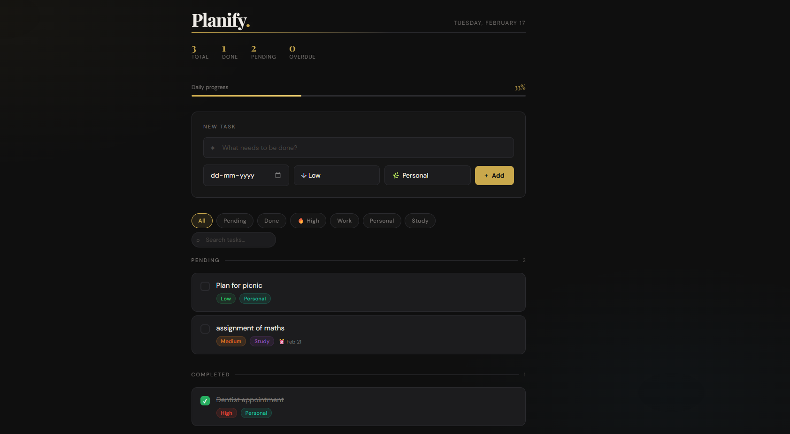

# Opus · Task Manager

<p align="center">
  
</p>

<p align="center">
  
  
  
  
</p>

<p align="center">
  A beautifully crafted, single-file productivity app with a dark luxury aesthetic.<br/>
  No frameworks. No dependencies. Just HTML, CSS & vanilla JavaScript.
</p>

---

## ✦ Preview

> Dark luxury editorial design — Playfair Display serif meets DM Sans, with warm amber gold accents and cinematic depth.

---

## 🚀 Features

| Feature | Description |
|---|---|
| ✅ **Task Management** | Add, complete, and delete tasks instantly |
| 🏷️ **Priority Levels** | Low / Medium / High with color-coded badges |
| 📁 **Categories** | Organise tasks by Work, Personal, or Study |
| 📅 **Due Dates** | Smart labels — *"Due today"*, *"2d overdue"* with visual warnings |
| 🔍 **Live Search** | Filter tasks in real-time by keyword |
| 🎛️ **Filter Bar** | Quick-filter by status, priority, or category |
| 📊 **Live Stats** | Header counters for Total, Done, Pending, and Overdue |
| 📈 **Progress Bar** | Animated completion percentage tracker |
| 💾 **Persistence** | All tasks saved to `localStorage` — survive page refresh |
| 🔔 **Toast Notifications** | Subtle slide-in confirmations for every action |
| 💫 **Smooth Animations** | Task enter/exit transitions, hover effects, staggered reveals |
| 📱 **Responsive** | Works beautifully on desktop and mobile |

---

## 📁 Project Structure

```
opus-task-manager/
│
├── index.html          # Complete app — single self-contained file
├── banner.png          # Project banner image
└── README.md           # You're here
```

> The entire application lives in **one HTML file** — no build tools, no bundlers, no package manager needed.

---

## ⚡ Getting Started

### Option 1 — Open directly
Just double-click `index.html` in your file explorer. That's it.

### Option 2 — Serve locally
```bash
# Using Python
python -m http.server 8000

# Using Node.js
npx serve .

# Using VS Code
# Install the "Live Server" extension, then right-click index.html → Open with Live Server
```

Then open `http://localhost:8000` in your browser.

### Option 3 — Deploy instantly
Drop `index.html` into any of these for instant hosting:

- [**Netlify Drop**](https://app.netlify.com/drop) — drag & drop the file
- [**GitHub Pages**](https://pages.github.com/) — push to a repo and enable Pages
- [**Vercel**](https://vercel.com/) — connect your GitHub repo

---

## 🎨 Design System

```
Background     #0f0f0f   Deep charcoal
Surface        #161616   Panel background
Card           #1c1c1e   Task cards
Accent         #c9a84c   Warm amber gold
Text           #f0ede8   Warm off-white
Muted          #7a7673   Secondary text

Font (Display) Playfair Display — headings & numbers
Font (Body)    DM Sans — UI and task text
```

---

## 🖥️ Usage Guide

### Adding a Task
1. Type your task in the input field
2. (Optional) Set a due date, priority, and category
3. Press **Add** or hit `Enter`

### Completing a Task
Click the **checkbox** on the left of any task card to toggle completion.

### Filtering Tasks
Use the **filter bar** to view tasks by:
- `All` · `Pending` · `Done`
- `🔥 High` priority
- `Work` · `Personal` · `Study` category

### Searching
Type in the **search box** (top right of the filter bar) to find tasks by keyword in real-time.

---

## 🛠️ Customisation

Everything is in one file — open `index.html` in any editor and:

**Change the colour accent** — edit the `--accent` CSS variable at the top:
```css
:root {
  --accent: #c9a84c;   /* swap for any colour you like */
}
```

**Add a new category** — add an `<option>` inside `#categoryInput` and a matching CSS badge class:
```html
<option value="Health">🏃 Health</option>
```
```css
.badge-health { background: rgba(231,76,60,0.12); color: #e74c3c; }
```

---

## 🤝 Contributing

Contributions, issues, and feature requests are welcome!

1. Fork the project
2. Create your feature branch: `git checkout -b feature/amazing-feature`
3. Commit your changes: `git commit -m 'Add amazing feature'`
4. Push to the branch: `git push origin feature/amazing-feature`
5. Open a Pull Request

---

## 📄 License

Distributed under the **MIT License** — use it however you like.

```
MIT License — Copyright (c) 2025
Permission is granted, free of charge, to use, copy, modify, merge,
publish, distribute, sublicense, and/or sell copies of this software.
```

---

<p align="center">
  Made with ✦ and a lot of attention to detail
</p>
